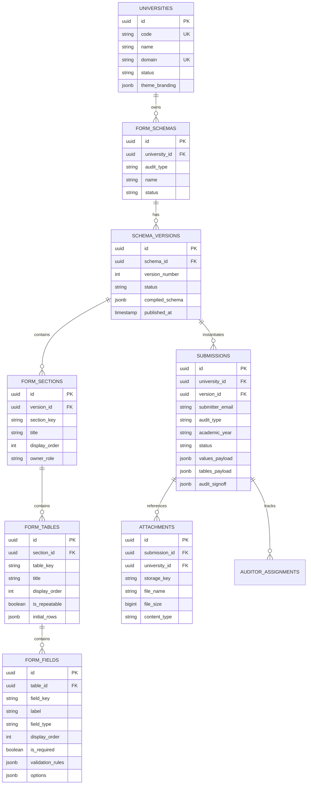
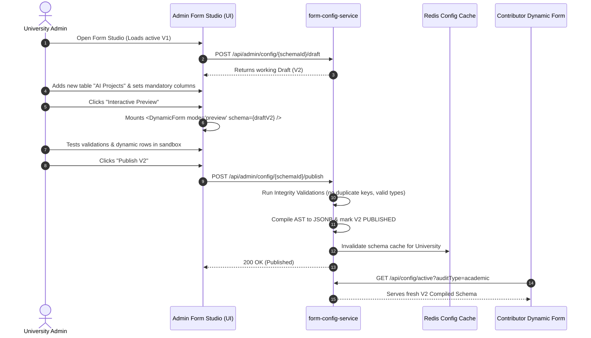

# Multi-University Dynamic Form & Configuration Architecture – Technical Design and Implementation Plan

---

## 1. Executive Summary

This document provides a comprehensive technical architecture blueprint for evolving the current **School & Director Appraisal System** from a single-institution platform (specifically built and hardcoded for D Y Patil International University, Akurdi Pune) into a multi-tenant, SaaS-ready, metadata-driven product capable of serving diverse universities.

### Key Strategic Highlights
- **Zero Disruption to Existing Operations**: The current production deployment for DYPIU (Academic & Administrative workflows) remains 100% operational with full backward compatibility and zero data loss.
- **Recommended Architectural Direction**: A **Hybrid Relational Metadata + Document/JSONB Submission Model**. Form definitions (Parts, Tables, Columns, Validations, UI Properties) are stored in strict, versioned relational metadata tables, while submission instance payloads are stored in JSONB columns with PostgreSQL GIN indexing for dynamic query performance and schemaless flexibility.
- **Service Evolution**: Refactoring the legacy `form-data-service` (which currently maintains 64 hardcoded relational tables) into a dedicated **`form-config-service`** that manages Tenant Configuration, Form Schemas, Versioning, and Publishing.
- **Dynamic Frontend Engine**: Replacing static React form schema files (`academicAudit2025.js`, `administrativeAuditConfig.js`) with an extensible, schema-driven Dynamic Form Renderer (`<DynamicForm />`, `<DynamicSection />`, `<DynamicTable />`, `<DynamicField />`) alongside an intuitive, non-technical **Admin Form Builder UI**.

---

## 2. Current System Overview

The current system automates university annual quality appraisals, dividing responsibilities between **Academic Audits** (submitted by School Directors) and **Administrative Audits** (submitted collaboratively across Administrative Heads: Registrar, HR, Dean Student Welfare, Dean Placement).

```
+-----------------------------------------------------------------------------------+
|                                  CURRENT SYSTEM FLOW                              |
+-----------------------------------------------------------------------------------+
|                                                                                   |
|  [ React 19 Frontend ] (Port 3003)                                                |
|       |                                                                           |
|       v  (REST / JWT)                                                             |
|  [ Spring Cloud Gateway ] (Port 9000)                                             |
|       +-------------------+--------------------+-------------------+              |
|       |                   |                    |                   |              |
|       v                   v                    v                   v              |
| [ auth-user-service ] [ form-data-service ] [ submission-service ] [ storage-service ]
|   (Port 9001)             (Port 9002)           (Port 9003)           (Port 9004)  |
|   appraisal_auth_user_db  appraisal_forms_db    appraisal_submission_db Disk (/uploads)
|                                                                                   |
+-----------------------------------------------------------------------------------+
```

### Key Workflow Phases
1. **Internal Audit Cycle (Version 1)**:
   - Contributor(s) draft and submit sections.
   - IQAC assigns Internal Auditors.
   - Auditors complete evaluations, assign scores/remarks, and submit.
   - IQAC reviews and VC grants approval.
2. **External Audit Cycle (Version 2)**:
   - Triggered upon Version 1 approval.
   - Independent external auditors evaluate the institutional report.
   - Final approval and archiving.

---

## 3. Current Architecture

### 3.1 Frontend Architecture
- **Framework**: React 19.2, Vite 8.0, React Router DOM 7.18.
- **Form State Management**: Controlled state via `useState` and `useEffect` in [`AuditForm.jsx`](file:///C:/Users/samar/OneDrive/Desktop/Faculty%20Appraisal%20Project/DYPIU-SchoolAppraisal-frontend/DYPIU-SchoolAppraisal/src/features/schoolAppraisal/components/AuditForm.jsx) and [`AdministrativeAuditDashboard.jsx`](file:///C:/Users/samar/OneDrive/Desktop/Faculty%20Appraisal%20Project/DYPIU-SchoolAppraisal-frontend/DYPIU-SchoolAppraisal/src/features/schoolAppraisal/administrativeAudit/AdministrativeAuditDashboard.jsx).
- **Schema Representation**: Hardcoded JavaScript objects:
  - [`academicAudit2025.js`](file:///C:/Users/samar/OneDrive/Desktop/Faculty%20Appraisal%20Project/DYPIU-SchoolAppraisal-frontend/DYPIU-SchoolAppraisal/src/features/schoolAppraisal/formSchemas/academicAudit2025.js) (6 major sections, 30+ tables).
  - [`administrativeAuditConfig.js`](file:///C:/Users/samar/OneDrive/Desktop/Faculty%20Appraisal%20Project/DYPIU-SchoolAppraisal-frontend/DYPIU-SchoolAppraisal/src/features/schoolAppraisal/administrativeAudit/administrativeAuditConfig.js) (5 major sections, 25+ tables).
- **Attachment Handling**: Files are uploaded on-the-fly to `/api/attachments/upload-multiple` via [`client.js`](file:///C:/Users/samar/OneDrive/Desktop/Faculty%20Appraisal%20Project/DYPIU-SchoolAppraisal-frontend/DYPIU-SchoolAppraisal/src/api/client.js). The returned file URLs are embedded directly into table row cells.

### 3.2 Java Microservices Backend
The backend comprises 6 Spring Boot 3.3.4 services on Java 17:

| Service | Port | Database | Primary Responsibility |
| :--- | :---: | :--- | :--- |
| **`api-gateway`** | `9000` | None | Edge routing, CORS, JWT validation filter |
| **`auth-user-service`** | `9001` | `appraisal_auth_user_db` | User accounts, roles, designations, MFA sessions |
| **`form-data-service`** | `9002` | `appraisal_forms_db` | 64 relational table entities (`model/academic/*`, `model/administrative/*`) |
| **`submission-service`**| `9003` | `appraisal_submission_db` | Submissions lifecycle, snapshots, reviews, assignments |
| **`storage-service`** | `9004` | Local Disk (`/app/uploads`) | Multipart file upload, ZIP download of attachments |
| **`admin-service`** | `9005` | Host Access | Database backup dumps and restoration |

### 3.3 Current Data Storage Paradigm
Currently, `submission-service` uses a **dual-storage pattern**:
1. **Live Draft & In-Flight Submissions**: Stored in the `submissions` table inside `appraisal_submission_db` as raw JSON strings:
   - `values_data TEXT` (Key-value map of form scalar inputs)
   - `tables_data TEXT` (Map of table IDs to array of row objects)
   - `attachments TEXT` (Array of attachment metadata objects)
2. **Approved Submissions Promotion**:
   - Upon final approval, [`TableDataPromotionService.java`](file:///C:/Users/samar/OneDrive/Desktop/Faculty%20Appraisal%20Project/DirectorAppraisal/director-appraisal/submission-service/src/main/java/com/director_appraisal/submission_service/service/TableDataPromotionService.java) reflects over JPA classes in `form-data-service` and executes JDBC `INSERT` statements into 64 normalized SQL tables in `appraisal_forms_db`.

---

## 4. Current Form Architecture

### 4.1 Schema Definition Model
Schemas are currently defined as static JS object trees in the frontend.

```javascript
// Academic Form Structure Sample (academicAudit2025.js)
export const academicAudit2025Schema = {
  id: "academic-audit-2025-26",
  title: "External Academic Audit",
  academicYear: "July, 2025 - June, 2026",
  ownerRole: "director-schools",
  header: { university: "D Y Patil International University Akurdi Pune", ... },
  sections: [
    {
      id: "part-a-academic-activities",
      title: "Part A - Academic Activities",
      blocks: [
        {
          type: "tables",
          tables: [
            {
              id: "boardOfStudies",
              title: "1. Board of Studies meetings conducted",
              columns: ["Sr No", "Date of the meeting", "Link for MoM"]
            }
          ]
        }
      ]
    }
  ]
};
```

---

## 5. Current Parts/Sections and Table/Form Structure (Inspected from Code)

An exhaustive code inspection reveals **11 distinct Parts/Sections** and **64 distinct Tables** across the system.

### 5.1 Academic Audit Sections & Tables (School Level)

| Section / Part ID | Title / Role | Number of Tables | Tables List & Structure |
| :--- | :--- | :---: | :--- |
| **`school-department-information`** | Basic School Info (Director) | 2 | `studentStrength` (Sanctioned Intake, Admitted), `facultyStrength` (Required, Available) |
| **`part-a-academic-activities`** | Academic Activities | 5 | `boardOfStudies`, `syllabusRevision`, `obeImplementation` (4 default rows), `nepStatus` (6 default rows), `bestPractices` |
| **`part-b-student-progression`** | Student Development & Progression | 15 | `studentMentoring`, `graduatingStudents`, `successRate`, `qualifyingExams`, `studentAwards`, `studentPlacements`, `higherStudies`, `studentStartups`, `studentCourses`, `alumniInteractions`, `guestLectures`, `professionalBodies`, `valueAddedCourses`, `careerGuidance`, `extensionActivities` |
| **`part-c-faculty-research`** | Faculty Development & Research | 12 | `facultySpecialization`, `researchPublications`, `booksChapters`, `corporateTraining`, `consultancy`, `researchFunds`, `eContents`, `teacherAwards`, `patentsCopyrights`, `fdpOrganized`, `fdpAttended`, `functionalMous` |
| **`part-d-swoc-analysis`** | SWOC Analysis | 5 | `swocStrength`, `swocWeaknesses`, `swocOpportunities`, `swocChallenges`, `swocOtherInformation` |
| **`part-e-observations`** | Audit Observations & Scores | 0 (Fields only) | Evaluator scores, remarks, recommendations, signed PDF upload |

### 5.2 Administrative Audit Sections & Tables (University Level)

| Section / Part ID | Contributor Role | Number of Tables | Tables List & Structure |
| :--- | :--- | :---: | :--- |
| **`section-a-university-info`** | Registrar | 6 | `coursesOffered`, `studentStatistics` (SC/ST/OBC/General), `statutoryBodies` (11 statutory committees), `auditRecords` (Financial, Energy, Green, Gender, AAA), `scholarshipSummary`, `scholarshipStudents` |
| **`section-b-faculty-staff`** | HR | 5 | `facultyInformation`, `facultyExperience`, `facultyTenure`, `supportingStaff`, `staffTraining` |
| **`section-c-student-welfare`** | Dean Student Welfare (DSW) | 6 | `sportsFacilities`, `culturalActivities`, `sportsActivities`, `adminStudentAwards`, `communityActivities`, `divyangajanFacilities` |
| **`section-d-placement`** | Dean Placement | 3 | `trainingActivities`, `industryCollaborations`, `hackathons` |
| **`section-e-infrastructure`** | Registrar / Central Office | 5 | `buildingInfrastructure`, `libraryInfrastructure`, `itInfrastructure`, `eResources`, `researchResources` |

---

## 6. Current Problems & Limitations for Multi-University SaaS

1. **Hardcoded University Identity**:
   - University name (`"D Y Patil International University Akurdi Pune"`), establishment acts, logos, and Pune address are hardcoded in schema files and UI JSX headers.
   - Email domains (`@dypiu.ac.in`) and school names (`SOECE`, `SOM`, `SOD`, `SOBE`, `SOB`, `SOP`, `SOL`, `SOAS`) are hardcoded in validators and backend logic.
2. **Schema Inflexibility**:
   - Adding, renaming, or reordering a column or table requires a developer to edit React files, update Spring Boot JPA entities, run SQL DDL migrations, and re-deploy Docker containers.
3. **Rigid Dual Database Architecture**:
   - The 64 normalized SQL tables in `form-data-service` break immediately if University B does not have `nepStatus` or wants 7 columns in `researchPublications` instead of 5.
4. **Lack of Tenant Scoping**:
   - No `tenant_id` or `university_id` exists in `users`, `submissions`, or JPA entities. All users share the same un-partitioned namespace.
5. **Destructive Updates**:
   - If a table structure changes in the current codebase, existing historical submissions can fail deserialization or render incorrectly.

---

## 7. Multi-University Functional & Non-Functional Requirements

### 7.1 Functional Requirements
- **Tenant Management**: Super-Admin can register new universities with distinct domains, branding, logos, and administrator accounts.
- **Visual Admin Form Builder**: University Admins can visually create, edit, reorder, and remove Sections, Tables, Columns, and Validation rules.
- **Field Type Extensibility**: Support for Text, Number, Date, Year, Dropdown, Multi-select, Textarea, File Attachment, Formula/Computed, and Dynamic Row Repeaters.
- **Workflow Versioning**: Draft $\to$ Preview $\to$ Validation $\to$ Publish lifecycle. Published configurations are immutable snapshots.
- **Historical Readability**: Old submissions are forever linked to the exact Configuration Version under which they were submitted.

### 7.2 Non-Functional Requirements
- **Tenant Data Isolation**: Zero risk of cross-tenant data leakage.
- **Sub-100ms Form Rendering**: Metadata cached in-memory/Redis; forms render dynamically without lag.
- **High Data Integrity**: Strong schema validation on the backend regardless of frontend state.
- **Storage Scalability**: Multi-tenant partitioned object storage for file attachments.

---

## 8. Database Architecture Options & In-Depth Comparison

| Criterion | Option A: Dynamic Physical SQL Tables (DDL per Form) | Option B: Pure EAV (Entity-Attribute-Value) | Option C: Pure Document / NoSQL | Option D: Hybrid Relational Metadata + JSONB Submissions (**RECOMMENDED**) |
| :--- | :--- | :--- | :--- | :--- |
| **Description** | Backend executes `CREATE TABLE` and `ALTER TABLE` when an Admin adds tables/columns. | All data stored in `entity_id`, `attribute_id`, `value_text` rows. | Entire schemas and submissions stored in MongoDB or CouchDB. | Relational tables for Configuration & Version metadata; Submissions store form payloads in PostgreSQL `JSONB`. |
| **Data Integrity** | High (native SQL constraints) | Low (all values cast to strings) | Medium (application enforced) | **High** (Backend validates against Relational Metadata before storing in JSONB). |
| **Schema Changes** | Extremely High Risk (DDL locks, migration scripts) | No DDL needed | No DDL needed | **Zero DDL needed** (New versions add rows to metadata; submissions adapt instantly). |
| **Query & Report Performance** | High for standard queries; catastrophic for multi-tenant maintenance | Extremely Poor (requires 30+ SQL joins per form view) | Medium (poor relational joins across users/audit cycles) | **Very High** (PostgreSQL JSONB with GIN indexes and SQL/JSON path operators). |
| **Historical Versioning** | Complex (Requires duplicating physical tables per version) | Moderate (EAV tables balloon rapidly) | Good (Schema versions embedded in documents) | **Excellent** (Submission stores `config_version_id` referencing the immutable schema snapshot). |
| **Security & Injection** | Extreme risk of SQL injection via dynamic DDL | Safe from DDL injection | Safe from SQL injection | **Zero SQL/DDL injection risk** (Standard parameterized JPA queries). |
| **Operational Complexity** | Unmaintainable at SaaS scale | Unmaintainable query complexity | Dual-database stack overhead | **Minimal** (Leverages existing PostgreSQL 16 cluster). |

---

## 9. Recommended Target Architecture

### 9.1 The Hybrid Relational Metadata + JSONB Model

```
+-------------------------------------------------------------------------------------------------------+
|                                    PROPOSED TARGET ARCHITECTURE                                       |
+-------------------------------------------------------------------------------------------------------+
|                                                                                                       |
|  [ University Admin UI ]                     [ Contributor / Auditor / Reviewer UI ]                  |
|     (Form Builder & Studio)                     (Dynamic Form Renderer & Dashboard)                   |
|              \                                              /                                         |
|               \                                            /                                          |
|                v                                          v                                           |
|       +------------------------------------------------------------+                                  |
|       |                     API GATEWAY (Port 9000)                |                                  |
|       |          (Tenant Resolution Filter, JWT Auth Filter)       |                                  |
|       +------------------------------------------------------------+                                  |
|                 |                                    |                                                |
|                 v                                    v                                                |
|       +-----------------------+            +-----------------------+                                  |
|       |  form-config-service  |            |  submission-service   |                                  |
|       |      (Port 9002)      |            |      (Port 9003)      |                                  |
|       +-----------------------+            +-----------------------+                                  |
|       | Relational Metadata:  |            | Multi-Tenant Storage: |                                  |
|       | - universities        |            | - submissions (JSONB) |                                  |
|       | - form_schemas        |            | - submission_reviews  |                                  |
|       | - schema_versions     |            | - auditor_assignments |                                  |
|       | - form_sections       |            +-----------------------+                                  |
|       | - form_tables         |                        |                                              |
|       | - form_fields         |                        v                                              |
|       +-----------------------+            +-----------------------+                                  |
|                                            |    storage-service    |                                  |
|                                            |      (Port 9004)      |                                  |
|                                            |  Tenant-isolated S3/  |                                  |
|                                            |   GCS/Local Volume    |                                  |
|                                            +-----------------------+                                  |
+-------------------------------------------------------------------------------------------------------+
```

### Why This Architecture Wins:
1. **Separation of Schema vs. Payload**: `form-config-service` owns structural rules; `submission-service` owns transactional form instances.
2. **Infinite Form Flexibility**: University A can have 8 sections and 40 tables; University B can have 2 sections and 5 tables—both use the exact same backend engine and database schema.
3. **Guaranteed Immutability**: Modifying a form never alters active submissions; it simply branches into a new `schema_version`.

---

## 10. Detailed Database Design (Proposed Schema)

All tables include `university_id` (UUID/Long) for strict multi-tenant isolation.



### Table Definitions & Attributes

#### 1. `universities`
- `id` (UUID, Primary Key)
- `code` (VARCHAR(50), Unique - e.g., `"dypiu"`, `"mit_wpu"`)
- `name` (VARCHAR(255), e.g., `"D Y Patil International University"`)
- `domain` (VARCHAR(100), Unique - e.g., `"dypiu.ac.in"`)
- `status` (VARCHAR(20), Default: `'ACTIVE'`)
- `theme_branding` (JSONB - stores header logo URLs, address, primary colors, establishment acts)

#### 2. `form_schemas`
- `id` (UUID, Primary Key)
- `university_id` (UUID, Foreign Key $\to$ `universities.id`)
- `audit_type` (VARCHAR(50) - `'ACADEMIC'`, `'ADMINISTRATIVE'`)
- `name` (VARCHAR(255) - e.g., `"Academic Appraisal Audit"`)
- `active_version_id` (UUID, Nullable $\to$ `schema_versions.id`)

#### 3. `schema_versions`
- `id` (UUID, Primary Key)
- `schema_id` (UUID, Foreign Key $\to$ `form_schemas.id`)
- `version_number` (INT, e.g., 1, 2, 3)
- `status` (VARCHAR(20) - `'DRAFT'`, `'PUBLISHED'`, `'ARCHIVED'`)
- `compiled_schema` (JSONB - full compiled AST representation of the form for fast single-roundtrip client fetching)
- `published_by` (VARCHAR(100))
- `published_at` (TIMESTAMP)

#### 4. `form_sections`
- `id` (UUID, Primary Key)
- `version_id` (UUID, Foreign Key $\to$ `schema_versions.id`)
- `section_key` (VARCHAR(100) - e.g., `"part-a-academic-activities"`)
- `title` (VARCHAR(255) - e.g., `"Part A - Academic Activities"`)
- `display_order` (INT)
- `owner_role` (VARCHAR(50) - e.g., `"director"`, `"registrar"`, `"hr"`)

#### 5. `form_tables`
- `id` (UUID, Primary Key)
- `section_id` (UUID, Foreign Key $\to$ `form_sections.id`)
- `table_key` (VARCHAR(100) - e.g., `"research_publications"`)
- `title` (VARCHAR(255))
- `display_order` (INT)
- `is_repeatable` (BOOLEAN, Default: `TRUE`)
- `initial_rows` (JSONB - array of static default rows, e.g., NEP checkpoints)

#### 6. `form_fields` (Columns and Scalar Inputs)
- `id` (UUID, Primary Key)
- `table_id` (UUID, Foreign Key $\to$ `form_tables.id`, Nullable if top-level section field)
- `section_id` (UUID, Foreign Key $\to$ `form_sections.id`)
- `field_key` (VARCHAR(100) - e.g., `"title_of_paper"`, `"publication_date"`)
- `label` (VARCHAR(255))
- `field_type` (VARCHAR(50) - `'TEXT'`, `'NUMBER'`, `'DATE'`, `'TEXTAREA'`, `'SELECT'`, `'ATTACHMENT'`, `'MULTISELECT'`)
- `display_order` (INT)
- `is_required` (BOOLEAN, Default: `FALSE`)
- `validation_rules` (JSONB - e.g., `{"min": 0, "max": 1000, "regex": "^https?://.*"}`)
- `options` (JSONB - dropdown values array, e.g., `["Available", "Not Available"]`)

#### 7. `submissions` (Multi-Tenant Transactional Entity)
- `id` (UUID, Primary Key)
- `university_id` (UUID, Foreign Key $\to$ `universities.id`, Index)
- `version_id` (UUID, Foreign Key $\to$ `schema_versions.id`)
- `audit_type` (VARCHAR(50))
- `academic_year` (VARCHAR(20))
- `submitter_email` (VARCHAR(255))
- `school` (VARCHAR(100), Nullable)
- `status` (VARCHAR(50) - `'DRAFT'`, `'SUBMITTED'`, `'UNDER_REVIEW'`, `'APPROVED'`, `'FINAL'`)
- `values_payload` (JSONB, GIN Indexed)
- `tables_payload` (JSONB, GIN Indexed)
- `audit_signoff` (JSONB)
- `created_at`, `updated_at` (TIMESTAMP)

---

## 11. Configuration Versioning & Immutability Rules

```
+-----------------------------------------------------------------------------------+
|                        VERSIONING & ROLLBACK LIFECYCLE                            |
+-----------------------------------------------------------------------------------+
|                                                                                   |
|  [ University Admin ]                                                             |
|         |                                                                         |
|         v  (Creates new draft)                                                    |
|  +-------------------------------------+                                          |
|  | Schema V2 (Status: DRAFT)           |                                          |
|  | - Adds "Patents Applied" column     |                                          |
|  | - Reorders Section B                |                                          |
|  +-------------------------------------+                                          |
|         |                                                                         |
|         v  (Clicks "Publish")                                                     |
|  +-------------------------------------+                                          |
|  | Schema V2 (Status: PUBLISHED)       | <---+ (Active pointer updated)           |
|  +-------------------------------------+     |                                    |
|                                              |                                    |
|  [ New Submissions (2026-27) ] ------------->+                                    |
|                                                                                   |
|  [ Historical Submissions (2025-26) ] -------> [ Schema V1 (Status: ARCHIVED) ]   |
|                                                (Read-only forever)                |
+-----------------------------------------------------------------------------------+
```

### Safety Principles:
1. **Never Overwrite a Published Version**: Once a version is marked `PUBLISHED`, its records in `form_sections`, `form_tables`, and `form_fields` become strictly **read-only**.
2. **Draft Branching**: Edits always clone the active version into a new `DRAFT` (e.g., V2).
3. **Zero Impact on Historical Submissions**: Existing submissions reference `version_id = V1`. When rendered in report or review mode, the UI requests schema `V1`, rendering the exact historical form faithfully.
4. **Soft Deletions**: Deleting a section or table in a new version simply omits it from `V2`; `V1` retains it permanently.
5. **Instant Rollback**: If an accidental configuration is published, the Admin can point the `active_version_id` back to `V1` with one click.

---

## 12. Draft $\to$ Preview $\to$ Publish Workflow



---

## 13. Admin Form Builder UI Design

### 13.1 Studio UX Structure
The Admin Form Studio will feature a 3-pane responsive layout:

```
+---------------------------------------------------------------------------------------------------+
|  [ University Selector: DYPIU ]  |  Form: Academic Appraisal V2 (Draft)  |  [ Preview ] [ Publish ] |
+---------------------------------------------------------------------------------------------------+
|  PALETTE / HIERARCHY       |  CANVAS / FORM BUILDER WORKSPACE         |  PROPERTY INSPECTOR        |
+----------------------------+------------------------------------------+----------------------------+
|  [ + Add Section ]         |  Section: Part C - Research              |  Field: Research Papers   |
|                            |  --------------------------------------- |  ------------------------- |
|  - University Information  |  Table: 2. Research Publications         |  Label: Paper Title        |
|  - Part A: Academics       |  [:: Drag Handle]                        |  Key: paper_title          |
|  > Part C: Research        |  +-------------------------------------+ |  Type: [ Dropdown v ]      |
|    - Faculty Details       |  | Col 1: Title of Paper (Text)        | |  Required: [x] Yes         |
|    - Research Pubs (Active)|  | Col 2: Journal Name (Text)          | |  Validation:               |
|    - Patents               |  | Col 3: Impact Factor (Number)       | |  - Max Length: 255         |
|  - Part D: SWOC            |  | Col 4: Proof / URL (Attachment)     | |  - Min Value: 0            |
|                            |  +-------------------------------------+ |  Attachment Rules:         |
|  [ + Add Table ]           |  [ + Add Column ]                        |  - Allowed: PDF, JPG       |
|  [ + Add Attachment Field ]|                                          |  - Max Size: 10MB          |
+---------------------------------------------------------------------------------------------------+
```

### 13.2 Safeguards for Non-Technical Administrators
- **Key Auto-Generation**: As the user types `"Title of Paper"`, the key is automatically generated as `title_of_paper` (with duplicate detection).
- **Destructive Action Confirmation**: Deleting a table prompts a modal warning: *"This table will be omitted in future submissions. Historical submissions will retain their records."*
- **Publish Pre-Flight Check**: Checks that every table has at least one column and no orphan fields exist before allowing publication.

---

## 14. Dynamic React Rendering Architecture

### 14.1 Component Hierarchy

```
<DynamicForm schema={compiledSchema} initialData={draftPayload} />
   │
   ├── <FormHeader branding={schema.branding} />
   │
   ├── <DynamicSection section={partA}>
   │      │
   │      ├── <DynamicField field={scalarField1} />
   │      ├── <DynamicField field={scalarField2} />
   │      │
   │      └── <DynamicTable tableConfig={table1}>
   │             │
   │             ├── <TableHeader columns={table1.columns} />
   │             ├── <TableRowRenderer rows={data.rows}>
   │             │      ├── <DynamicCell type="TEXT" />
   │             │      ├── <DynamicCell type="DATE" />
   │             │      └── <DynamicCell type="ATTACHMENT" />
   │             └── <TableActionButtons onAddRow={...} onImportExcel={...} />
   │
   └── <FormActionBar onSaveDraft={...} onSubmit={...} onExportPDF={...} />
```

### 14.2 Schema Interpretation & Rendering Code Sample (`DynamicField.jsx`)

```jsx
// PROPOSED / DOCUMENTATION ONLY
import React from 'react';

export const DynamicField = ({ fieldConfig, value, onChange, readOnly, errors }) => {
  const { fieldKey, label, fieldType, isRequired, options, validationRules } = fieldConfig;

  const handleChange = (val) => {
    onChange(fieldKey, val);
  };

  switch (fieldType) {
    case 'TEXT':
    case 'EMAIL':
    case 'NUMBER':
      return (
        <div className="form-group">
          <label>{label} {isRequired && <span className="text-danger">*</span>}</label>
          <input
            type={fieldType.toLowerCase()}
            className="form-control"
            disabled={readOnly}
            value={value || ''}
            onChange={(e) => handleChange(e.target.value)}
          />
          {errors?.[fieldKey] && <div className="field-error">{errors[fieldKey]}</div>}
        </div>
      );

    case 'TEXTAREA':
      return (
        <div className="form-group">
          <label>{label}</label>
          <textarea
            className="form-control"
            disabled={readOnly}
            maxLength={validationRules?.maxLength || 2000}
            value={value || ''}
            onChange={(e) => handleChange(e.target.value)}
          />
        </div>
      );

    case 'SELECT':
      return (
        <div className="form-group">
          <label>{label}</label>
          <select
            className="form-select"
            disabled={readOnly}
            value={value || ''}
            onChange={(e) => handleChange(e.target.value)}
          >
            <option value="">-- Select --</option>
            {options?.map((opt) => (
              <option key={opt} value={opt}>{opt}</option>
            ))}
          </select>
        </div>
      );

    case 'ATTACHMENT':
      return (
        <AttachmentUploadCell
          fieldConfig={fieldConfig}
          value={value}
          readOnly={readOnly}
          onChange={handleChange}
        />
      );

    default:
      return <input type="text" value={value || ''} onChange={(e) => handleChange(e.target.value)} />;
  }
};
```

---

## 15. Attachment & Storage Architecture

### 15.1 Multi-Tenant File Isolation
Uploaded files are stored with structured storage paths:
`{university_id}/{academic_year}/{audit_type}/{submission_id}/{column_key}/{uuid}_{filename}`

### 15.2 Attachment Metadata Model
Attachments are stored in a dedicated `attachments` table:
```sql
CREATE TABLE attachments (
    id UUID PRIMARY KEY DEFAULT gen_random_uuid(),
    university_id UUID NOT NULL REFERENCES universities(id),
    submission_id UUID NOT NULL REFERENCES submissions(id) ON DELETE CASCADE,
    section_key VARCHAR(100) NOT NULL,
    table_key VARCHAR(100),
    field_key VARCHAR(100) NOT NULL,
    storage_key VARCHAR(500) NOT NULL,
    file_name VARCHAR(255) NOT NULL,
    content_type VARCHAR(100) NOT NULL,
    file_size BIGINT NOT NULL,
    uploaded_by VARCHAR(255) NOT NULL,
    created_at TIMESTAMP WITH TIME ZONE DEFAULT NOW()
);
CREATE INDEX idx_attachments_sub ON attachments(submission_id);
CREATE INDEX idx_attachments_tenant ON attachments(university_id);
```

---

## 16. Microservices Decomposition & Communication

```
+----------------------------------------------------------------------------------------------------+
|                                    MICROSERVICE RESPONSIBILITIES                                   |
+----------------------------------------------------------------------------------------------------+
|                                                                                                    |
|  1. api-gateway (Port 9000)                                                                        |
|     - Tenant resolution from Host Header (dypiu.appraisal.com) or Subdomain / Path                 |
|     - Injects X-Tenant-Id and X-User-Roles into downstream service requests                        |
|                                                                                                    |
|  2. auth-user-service (Port 9001)                                                                  |
|     - Multi-tenant User model (users scoped to university_id)                                      |
|     - RBAC: SUPER_ADMIN, UNIVERSITY_ADMIN, DIRECTOR, REGISTRAR, HR, DSW, PLACEMENT, AUDITOR, VC, IQAC |
|                                                                                                    |
|  3. form-config-service (Port 9002 - Refactored from form-data-service)                           |
|     - Owns Schema Builder, Versioning, Drafts, Validation Rules, UI Ast Compiler                   |
|     - Provides GET /api/config/compiled?auditType=academic to Frontend                             |
|                                                                                                    |
|  4. submission-service (Port 9003)                                                                 |
|     - Stores form draft/submitted JSONB payloads against specific schema_version_id                |
|     - Executes server-side validation against compiled schema before accepting submission          |
|     - Manages audit review cycles, multi-contributor workflow, signatures, snapshots               |
|                                                                                                    |
|  5. storage-service (Port 9004)                                                                    |
|     - Multipart stream upload, virus scan hook, multi-tenant directory partitioning                |
|     - On-the-fly ZIP generation for auditor/admin downloads                                        |
|                                                                                                    |
|  6. admin-service (Port 9005)                                                                      |
|     - Tenant-scoped backups, database diagnostics, audit logging exports                           |
|                                                                                                    |
+----------------------------------------------------------------------------------------------------+
```

### Inter-Service Communication
- **Synchronous REST via OpenFeign**: Used for user details, schema compilation, and submission verification.
- **Why Kafka/RabbitMQ is Overengineering**: The platform handles bounded annual submission cycles (hundreds of submissions per university per year, not millions per second). Synchronous REST with Redis caching is cleaner, lower-latency, and significantly easier to operate.

---

## 17. Proposed API Contracts (Documentation Level)

### 17.1 Configuration Management APIs (`form-config-service`)

#### `GET /api/config/active`
- **Headers**: `X-Tenant-Id: <uuid>`, `Authorization: Bearer <jwt>`
- **Query Params**: `auditType=academic`
- **Response**:
```json
{
  "schemaId": "3fa85f64-5717-4562-b3fc-2c963f66afa6",
  "versionId": "7b1c3e45-1234-4567-8901-abcdef123456",
  "versionNumber": 2,
  "auditType": "ACADEMIC",
  "branding": {
    "universityName": "D Y Patil International University Akurdi Pune",
    "logoUrl": "https://cdn.appraisal.com/dypiu/logo.png",
    "themeColor": "#1e3a8a"
  },
  "sections": [
    {
      "sectionKey": "part-a-academic-activities",
      "title": "Part A - Academic Activities",
      "displayOrder": 1,
      "ownerRole": "director",
      "fields": [],
      "tables": [
        {
          "tableKey": "boardOfStudies",
          "title": "1. Board of Studies meetings conducted",
          "isRepeatable": true,
          "columns": [
            { "fieldKey": "sr_no", "label": "Sr No", "fieldType": "TEXT" },
            { "fieldKey": "date_of_meeting", "label": "Date of Meeting", "fieldType": "DATE", "isRequired": true },
            { "fieldKey": "mom_link", "label": "Link for MoM", "fieldType": "ATTACHMENT", "isRequired": true }
          ]
        }
      ]
    }
  ]
}
```

#### `POST /api/admin/config/sections`
- **Headers**: `X-Tenant-Id: <uuid>`, `Authorization: Bearer <admin-jwt>`
- **Request Body**:
```json
{
  "versionId": "7b1c3e45-1234-4567-8901-abcdef123456",
  "sectionKey": "part-f-innovation",
  "title": "Part F - Innovation & Incubation",
  "displayOrder": 6,
  "ownerRole": "director"
}
```

---

## 18. Multi-Tenant Security & Tenant Isolation

```
+-----------------------------------------------------------------------------------+
|                             TENANT ISOLATION ARCHITECTURE                         |
+-----------------------------------------------------------------------------------+
|                                                                                   |
|  [ Request from user@dypiu.ac.in ]                                                |
|       |                                                                           |
|       v                                                                           |
|  [ API Gateway ]                                                                  |
|       ├── 1. Validates JWT Signature                                              |
|       ├── 2. Extracts `tenant_id = "dypiu_uuid"` from JWT Claims                  |
|       └── 3. Injects header `X-Tenant-Id: dypiu_uuid`                             |
|       |                                                                           |
|       v                                                                           |
|  [ Downstream Microservice (Spring Security Filter) ]                             |
|       ├── 4. Stores `tenant_id` in `TenantContextHolder` (ThreadLocal)            |
|       └── 5. Spring Data JPA / Hibernate automatically appends:                   |
|              `WHERE university_id = :tenantId` on all SELECT/UPDATE/DELETE queries|
+-----------------------------------------------------------------------------------+
```

---

## 19. Existing Data Migration Strategy

To transition DYPIU’s active production data into the new multi-tenant architecture without loss:

```
+-----------------------------------------------------------------------------------+
|                              MIGRATION FLOWCHART                                  |
+-----------------------------------------------------------------------------------+
|                                                                                   |
|  STEP 1: Seed DYPIU in `universities` table (ID = dypiu_uuid)                     |
|     │                                                                             |
|     ▼                                                                             |
|  STEP 2: Synthesize Schema V1 from `academicAudit2025.js` & config files          |
|     │    (Populate `form_schemas`, `schema_versions`, `form_sections`, etc.)      |
|     ▼                                                                             |
|  STEP 3: Migrate Users in `appraisal_auth_user_db`                                |
|     │    (Set `university_id = dypiu_uuid` on all existing records)               |
|     ▼                                                                             |
|  STEP 4: Migrate Submissions in `appraisal_submission_db`                         |
|     │    (Link each submission to `dypiu_uuid` and `schema_version_v1_id`)        |
|     ▼                                                                             |
|  STEP 5: Validate Payload Parity                                                  |
|          (Run dry-run comparison between old normalized tables & new JSONB)       |
+-----------------------------------------------------------------------------------+
```

---

## 20. Change Impact Matrix

| Area | Current Implementation | Required Change | Risk Level | Priority |
| :--- | :--- | :--- | :---: | :---: |
| **`form-data-service`** | 64 hardcoded JPA entities | Deprecate static tables; refactor into `form-config-service` | High | **P0** |
| **`submission-service`**| Stores unversioned JSON strings; dual JDBC promotion | Store versioned JSONB; validate against compiled schema | Medium | **P0** |
| **Frontend Renderer** | Hardcoded components per section | Unified `<DynamicForm />` engine | High | **P0** |
| **Admin Form Builder** | Does not exist (code edits required) | Build Studio UI with Drag-and-drop & Property Inspector | Medium | **P1** |
| **`auth-user-service`** | Single-tenant users | Add `university_id` column and multi-tenant JWT claims | Medium | **P0** |
| **`storage-service`** | Flat `/app/uploads` storage | Partition by `{tenant_id}/{academic_year}/...` | Low | **P1** |
| **Reporting / Export** | Custom React view printing | Server-side or client-side JSONB report generator | Medium | **P2** |

---

## 21. Step-by-Step Implementation Roadmap

```
+-------------------------------------------------------------------------------------------------------+
|                                    10-PHASE IMPLEMENTATION ROADMAP                                    |
+-------------------------------------------------------------------------------------------------------+
|                                                                                                       |
|  [ Phase 0: Architecture Validation & Baseline Lock ]                                                 |
|       │                                                                                               |
|       ▼                                                                                               |
|  [ Phase 1: Multi-Tenant Foundation (Tenant ID in Auth & Gateway) ]                                   |
|       │                                                                                               |
|       ▼                                                                                               |
|  [ Phase 2: Metadata Schema & `form-config-service` Backend ]                                         |
|       │                                                                                               |
|       ▼                                                                                               |
|  [ Phase 3: Dynamic React Form Renderer (`<DynamicForm />`) ]                                         |
|       │                                                                                               |
|       ▼                                                                                               |
|  [ Phase 4: Submission Service Refactoring (JSONB + Schema Validation) ]                             |
|       │                                                                                               |
|       ▼                                                                                               |
|  [ Phase 5: Storage Service Multi-Tenant Partitioning ]                                               |
|       │                                                                                               |
|       ▼                                                                                               |
|  [ Phase 6: Admin Form Studio UI (Drag-and-Drop Form Builder) ]                                       |
|       │                                                                                               |
|       ▼                                                                                               |
|  [ Phase 7: DYPIU Historical Data Migration & Verification ]                                          |
|       │                                                                                               |
|       ▼                                                                                               |
|  [ Phase 8: Multi-University Pilot (Onboard 2nd Institution) ]                                        |
|       │                                                                                               |
|       ▼                                                                                               |
|  [ Phase 9: Full Production SaaS Rollout & Decommissioning Legacy Code ]                              |
|                                                                                                       |
+-------------------------------------------------------------------------------------------------------+
```

---

## 22. What NOT to Do (Architectural Anti-Patterns)

1. **DO NOT execute dynamic DDL (`CREATE TABLE / ALTER TABLE`) in production**: Creates schema migration nightmares, table locking, and security vulnerabilities.
2. **DO NOT overwrite published configuration versions**: Any schema change must produce a new version so older submissions remain 100% interpretable.
3. **DO NOT store uploaded file binary data inside JSONB**: Only store lightweight attachment metadata and storage keys.
4. **DO NOT rely solely on frontend validation**: Backend must always validate payloads against the compiled schema before saving.
5. **DO NOT introduce message brokers (Kafka/RabbitMQ)**: Synchronous REST with Redis caching is faster, simpler, and completely adequate for the workload.

---

## 23. Decisions & Open Questions for Stakeholders

1. **Custom Formulas/Calculations**: Should the Form Builder allow admins to configure computed summary columns (e.g., `Total Students = UG + PG`) via math expressions, or should calculations remain standardized?
2. **Multi-Tenant Domain Routing**: Will universities access the app via subdomains (e.g., `dypiu.appraisal.com`, `mit.appraisal.com`) or a single login page with institution selection?
3. **Cloud Object Storage vs. Dedicated Server Disks**: Should file uploads move to S3/GCS or remain on an encrypted local Linux VM volume per tenant?

---

## 24. Final "DO NOT IMPLEMENT YET" Checklist

- [ ] **Architecture Blueprint Review**: Confirm target database schema and JSONB submission model with technical leadership.
- [ ] **Stakeholder Approval**: Verify non-technical Admin Form Builder UX wireframes.
- [ ] **Backup Verification**: Ensure full automated database snapshots of `appraisal_auth_user_db`, `appraisal_forms_db`, and `appraisal_submission_db` are stored before any migrations begin.
- [ ] **No Code Touched**: All current production codebases, Docker files, and databases remain untouched until Phase 1 kickoff.
